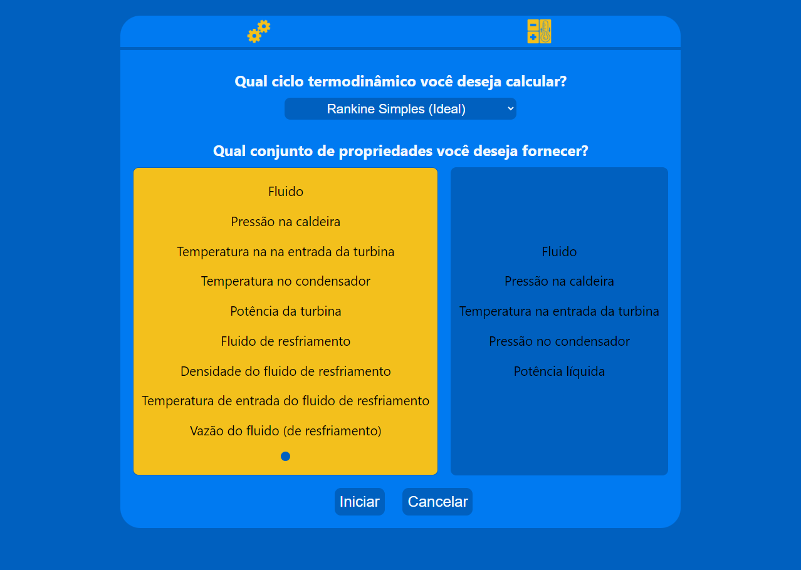
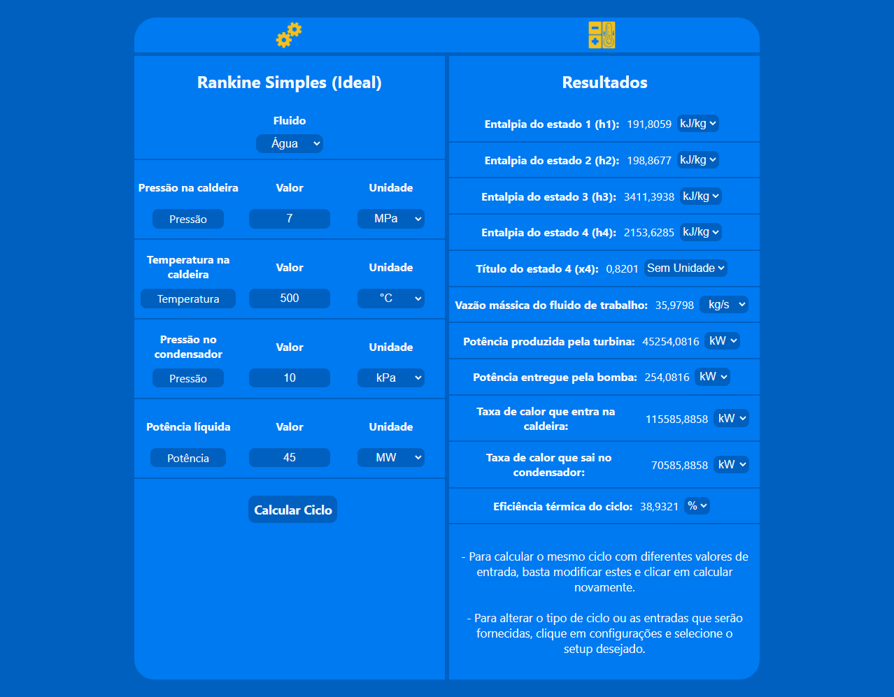

<h1 align="center" style="font-weight: bold;">Rankine Cycle  Calculator 🌡️	</h1>

<p align="center">
<b>This application allows the user to make calculations of thermodynamic vapor power cycles (Rankine) for academic use!</b>
</p>
<p align="center">
    
    
</p>

<h2 id="tech">Technologies</h2>

### Client:
  Built using React JS

### Server
  Built in Node JS, using express to create the API and the Python library CoolProp (get thermodynamic properties of fluids)

<h2 id="clone">Clone</h2>

<h4> Prerequisites</h4>

- Node >= 16.17.0 e npm >= 5.6 
- Package manager - NPM or YARN
- Python >= 3.10.6

<h4>Starting</h4>

```
git clone https://github.com/valmarath/TCC-React-Node.git
cd server
npm install
python -m pip install -r requirements.txt
cd ../client
npm install
```

<h5>Start server</h5>

```
  //in root
  cd server
  npm install
  python -m pip install -r requirements.txt
  npm run dev
```

<h5>Start Client</h5>

```
  //in root
  cd client
  npm install
  npm start
```
